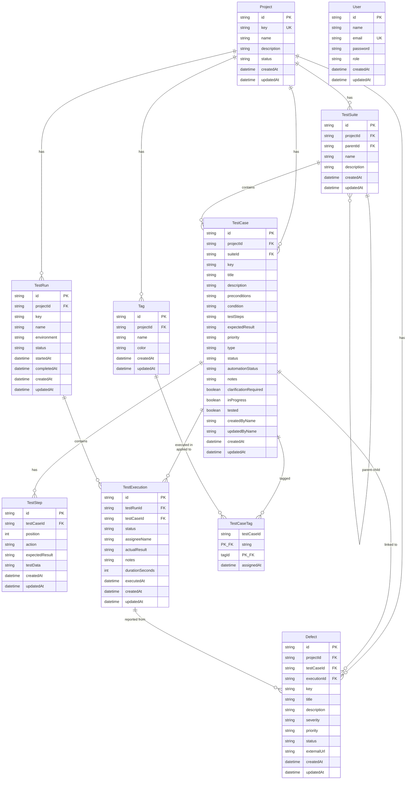

# Database Schema — ER Diagram

## Summary

| Table | Description |
|-------|-------------|
| **Project** | Top-level container for all test assets |
| **TestSuite** | Module/folder grouping (hierarchical via parentId) |
| **TestCase** | Individual test case with conditions, steps, expected results |
| **TestStep** | Ordered steps within a test case |
| **TestRun** | A test execution session (planned → in-progress → completed) |
| **TestExecution** | Status of a specific test case within a test run |
| **Defect** | Bug/defect linked to test case or execution |
| **Tag** | Labels for categorizing test cases |
| **TestCaseTag** | Many-to-many join table (TestCase ↔ Tag) |
| **User** | System users with role-based access (ADMIN, QA, DEV, VIEWER) |

## Key Relationships

- **Project** → cascades delete to all child entities
- **TestSuite** → self-referencing hierarchy (parent/children)
- **TestCase ↔ Tag** → many-to-many via TestCaseTag
- **TestExecution** → links TestRun + TestCase (unique per run)
- **Defect** → optionally linked to TestCase and/or TestExecution
- **User** → standalone (no FK, uses name fields in other tables)
